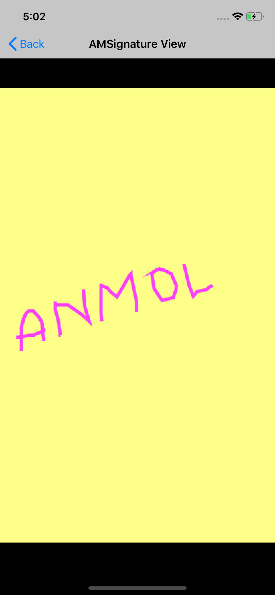

# AMSignatureView

Star⭐ the repo if you like what you see😉.

✨ Requirements:

• System(Macbook or iMac or MacMini)

• Operating System (i.e. MacOS X)

• Xcode 10.0 or above

In this image we take user signature or some hand writing text. For example I am taking my name.

In this image how will it look like.

